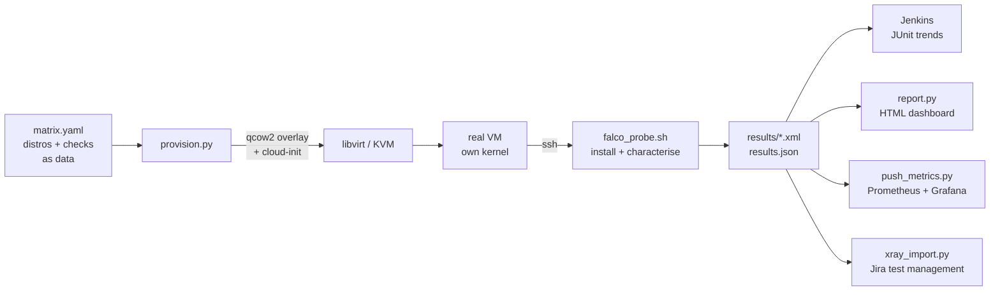

# kernel-matrix

A Jenkins-driven Linux kernel compatibility matrix. Boots real virtual machines
across distributions, installs [Falco](https://falco.org) — an open-source eBPF
security agent — and records **which driver it selected, what it cost, and
whether it actually detected anything.**

Built as a learning project to answer a question properly rather than
theoretically: *how do you test software across dozens of distro and kernel
combinations?*

---

## Why virtual machines and not containers

This is the decision the whole project rests on.

**Containers share the host kernel.** A container labelled "RHEL 9" gives you
RHEL 9 *userspace* — its glibc, its package manager, its filesystem layout —
running on whatever kernel the host happens to be booted into. If what you are
testing depends on the kernel, a container is lying to you by omission.

For an endpoint security agent the kernel is not incidental, it is the system
under test. Falco observes process activity by hooking into the kernel, and
which mechanism it can use is a direct function of kernel version:

| Fixture | Own kernel? | What it can actually test | Cost |
|---|---|---|---|
| Container | No, shares the host's | Userspace, packaging, install paths | Seconds, free |
| **Virtual machine** | **Yes** | **Kernel version, eBPF/BTF availability, driver selection** | Minutes, real money |
| Bare metal | Yes, plus real hardware | Secure Boot, TPM, honest performance | Slow, scarce |

The design principle underneath: **match fixture cost to the risk you are
actually buying down.** Reaching for the cheap fixture when only the expensive
one is valid is how teams ship bugs they believed were covered.

---

## What it measures

Falco picks its engine at runtime based on what the kernel supports, and
**the fallback is silent**. A pass/fail matrix would show all green while
hiding three very different realities:

| Driver | Requires | Notes |
|---|---|---|
| `modern_ebpf` | Recent kernel + BTF | CO-RE. The good path. |
| `ebpf` | eBPF support | Legacy probe, not portable across kernels |
| `kmod` | Kernel headers | Kernel module. Most invasive fallback. |

For each kernel the probe records driver selection, install time, time to
active, idle RSS and CPU, whether a synthetic event was detected, and time to
first alert. Plus six declarative checks (kernel version, kernel floor, BTF,
systemd, module list, package manager) declared as data in
[`matrix.yaml`](matrix.yaml).

---

## How it fits together



The lifecycle is borrowed from [Molecule](https://ansible.readthedocs.io/projects/molecule/),
which borrowed it from common sense: **create → prepare → converge → verify →
destroy**, with teardown in a `finally` block so it happens even on failure.

Disk stays cheap through qcow2 backing files. One base image is downloaded per
distro and treated as read-only; each VM gets a thin overlay storing only its
own writes. Ten VMs from one 600 MB base cost roughly 600 MB plus a couple of
hundred megabytes each, not 6 GB.

---

## Quick start

```bash
sudo apt install -y libvirt-daemon-system libvirt-clients virtinst qemu-kvm \
                    cloud-image-utils genisoimage python3-yaml
sudo usermod -aG libvirt,kvm $USER          # log out and back in
```

```bash
python3 provision.py --list                 # what is in the matrix
python3 provision.py --distro ubuntu-22.04 --keep
```

Then the payoff — two kernels, one machine:

```bash
uname -r                                    # host:  7.0.0-28-generic
ssh -i ~/.ssh/id_ed25519_kmatrix ubuntu@<vm-ip> uname -r
                                            # guest: 5.15.0-187-generic
```

Full matrix with characterisation:

```bash
python3 provision.py --tier fast --falco
python3 report.py
python3 push_metrics.py --gateway http://localhost:9092
```

Dashboards:

```bash
cd observability && cp .env.example .env && docker compose up -d
```

| Service | Port | What |
|---|---|---|
| Report | 8087 | Self-contained HTML, no dependencies |
| Grafana | 3002 | Trends across runs |
| Prometheus | 9091 | Metric store |
| Pushgateway | 9092 | Batch jobs push here; Prometheus scrapes it |

---

## Things that actually broke

Kept because every one is an environment problem rather than a code problem,
which is the whole reason "works on my machine" is an engineering issue and
not a joke.

| Symptom | Cause |
|---|---|
| Works by hand, fails in CI | `virsh` resolves to `qemu:///session` in non-interactive shells — no default network, no DHCP. Pinned `LIBVIRT_DEFAULT_URI`. |
| `apt` says PyYAML is installed, Python disagrees | A `~/.local/bin/python3` shadowing the system interpreter in login shells only |
| `Permission denied` on the disk image | `libvirt-qemu` cannot traverse a mode-750 home directory. `setfacl -m u:libvirt-qemu:x` |
| Debian VM boots, never gets an IP | `genericcloud` is the stripped-down cloud build. `generic` is the one with drivers. The naming is backwards from intuition. |
| Jenkins repo key rejected | The `jenkins.io-2023.key` in every guide online expired in March 2026 |
| `dubious ownership in repository` | Git refuses repos owned by another user since CVE-2022-24765 |

---

## Layout

```
matrix.yaml          the compatibility matrix, as data not code
provision.py         boot, wait, check, characterise, destroy
falco_probe.sh       runs inside the guest; emits JSON
report.py            results.json -> self-contained HTML
push_metrics.py      results.json -> Prometheus Pushgateway
xray_import.py       JUnit -> Jira/Xray, one environment per kernel
Jenkinsfile          preflight -> lint -> parallel matrix -> publish
observability/       docker compose: Prometheus, Grafana, Pushgateway, nginx
```

---

## Notes and limitations

- Falco stands in for a proprietary endpoint sensor. It is a genuine eBPF
  security agent with the same kernel-dependency profile, and it is free.
- The matrix is tiered deliberately. Real VMs cost real time, so cheap checks
  gate first, a small fast tier runs per build, and the full sweep runs
  nightly. That ordering is the point, not an optimisation.
- Six distros currently. Adding one is a few lines of YAML, by design.
- Built and tested on a single bare-metal host with KVM. The production shape
  would be a disposable Jenkins controller with a labelled `kvm` build agent,
  so only the machine that needs privileged access has it.
